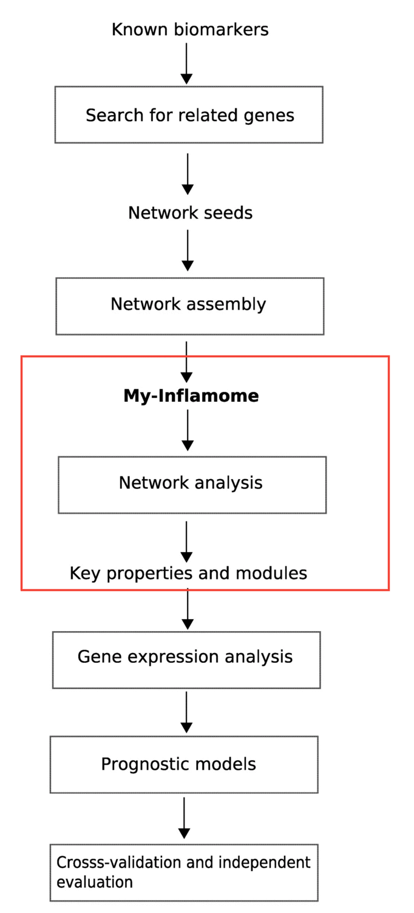
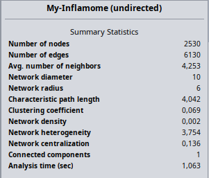
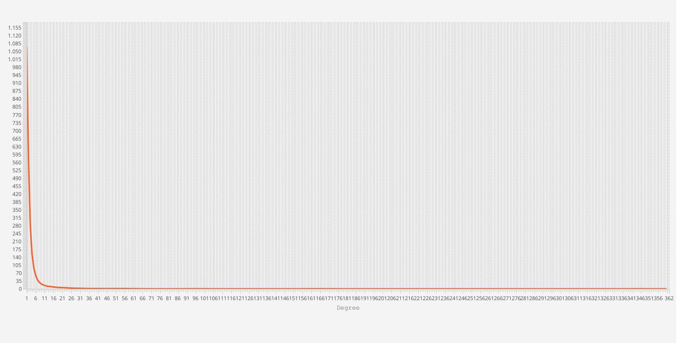
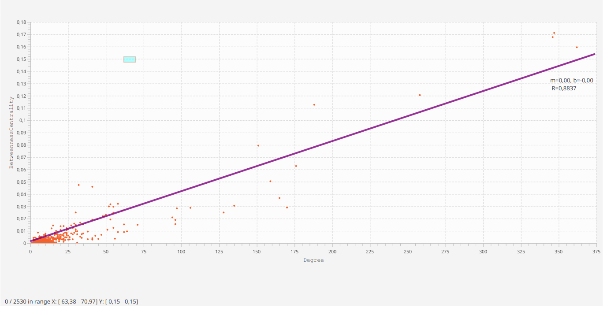
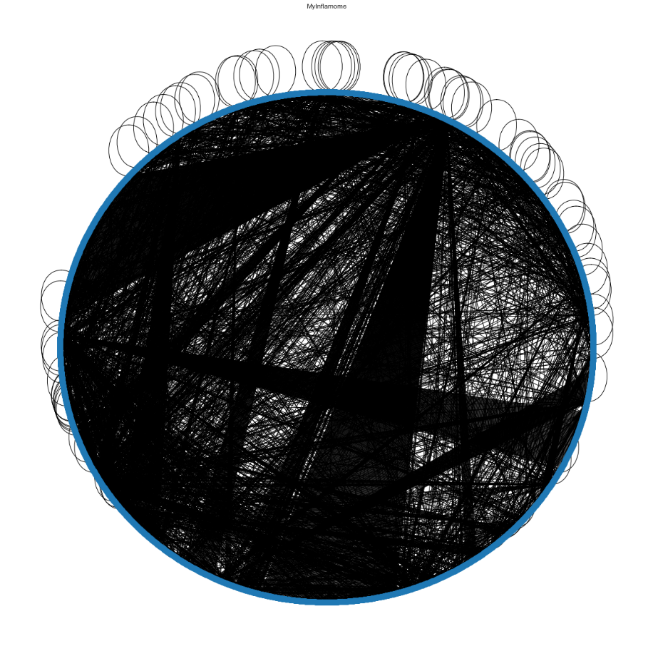
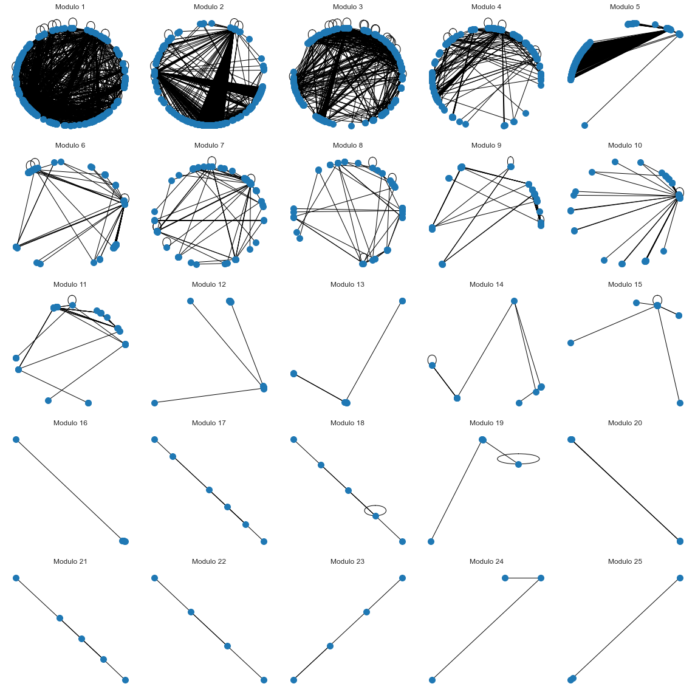

# Projeto 3 - Reproduzindo o Experimento de um Artigo Científico

O objetivo geral do projeto é reproduzir um experimento (total ou parcialmente) de um artigo científico. O tema do artigo deve estar relacionado a Ciência de Redes e Saúde. Poderão ser aceitos artigos cujos temas que tangenciam a área de saúde. Temas de artigos envolvendo ciência de redes em outros domínios deverão ser negociados previamente com os professores.

Recomenda-se o seguinte índice para encontrar artigos com dados de redes publicados: <https://icon.colorado.edu/#!/networks)[https://icon.colorado.edu/#!/networks>

A equipe tem a liberdade de adaptar e simplificar o experimento, conforme a disponibilidade dos dados, dos algoritmos e do grau de dificuldade na reprodução.

Para a reprodução do experimento, pode ser usada qualquer ferramenta/framework de processamento de redes complexas.

O trabalho será feito em equipes (preferencialmente as mesmas do P2).

# Relatório Final de Projeto P3

## Apresentação

O presente projeto foi originado no contexto das atividades da disciplina de pós-graduação [*Ciência e Visualização de Dados em Saúde*](https://ds4h.org), oferecida no primeiro semestre de 2022, na Unicamp.

|Nome  | RA | Especialização|
|--|--|--|
| Guilherme Augusto Amorim Terrell  | 168899  | Elétrica|
| Matheus Xavier Sampaio  | 220092  | Computação|

## Referência bibliográfica do artigo lido

Azuaje, F.; Rodius, S.; Zhang, L.; Devaux, Y.; Wagner, D. “Information encoded in a network of inflammation proteins predicts clinical outcome after myocardial infarction”. <https://bmcmedgenomics.biomedcentral.com/articles/10.1186/1755-8794-4-59>

## Resumo

O artigo em questão tem como finalidade predizer, através da construção de uma rede de inflamação de proteínas e da análise das interações entre elas, o estado clínico de um indivíduo após sofrer infarto do miocárdio (morte de uma parte do músculo cardíaco devido a ausência de irrigação sanguínea).

## Breve descrição do experimento/análise do artigo que foi replicado

O artigo apresenta a construção de uma rede de iterações entre proteinas de pacientes que sofrem de inflamação após o infarto do miocárdio.
Os autores realizam uma análise desta rede construída, e utilizam estas análises para investigar o potencial de prognóstico da rede.

|  |
|:--:|
| **Fluxograma de análises do artigo. Dentro do retângulo em vermelho encontra-se a parte que será reproduzida nesse projeto.** |

O objetivo do projeto é reproduzir e analisar a rede complexa construída no artigo, através da detecção de comunidades e de estatísticas quantitativas da rede como Tráfego (*Betweeness Centrality*) e do número de arestas associadas a um nó (*Degree*).

### Dados usados como entrada

|Dataset | Endereço na Web | Resumo descritivo|
|----- | ----- | -----|
| My-Infamome network data | <https://bmcmedgenomics.biomedcentral.com/articles/10.1186/1755-8794-4-59#Sec21> | Tabela que contém as interações entre proteínas relacionadas a inflamação e infarto do miocárdio|

## Método

Utilizamos o `Cytoscape` para construção da rede, obtenção de estatísticas gerais da rede (número de nós, número de arestas). Uma análise similar de construção de rede e a detecção de comunidades, além de algumas visualizações, foi feita através de um notebook escrito em Python utilizando a biblioteca `networkx`.

Foram realizadas analises da relação entre tráfego e grau dos nós. No artigo, os autores utilizam um algoritmo descrever um algoritmo de agrupamento de rede "guloso" que maximiza uma pontuação de modularidade Q, definida como: Q = (numIME/numE) - (numIME/numE) random , com numIME e numE representando o número de arestas em um módulo e o número total das arestas da rede, respectivamente. Em nossa reprodução, para a detecção de comunidades utilizamos o algoritmo de maximização gulosa de Clauset-Newman-Moore para encontrar a partição da comunidade com a maior modularidade. A maximização da modularidade começa com cada nó em sua própria comunidade e une repetidamente o par de comunidades que levam à maior modularidade até que nenhum aumento adicional seja possível.

## Resultados

|  |
|:--:|
| **Informações gerais da rede** |

### Grau de um nó, e relação entre grau e tráfego

Verifica-se que existem muitos nós com poucas conexões e poucos nós com muitas conexões. Este tipo de comportamento é muito comum a maioria das redes.
Ao verificar a relação entre o grau de um nó e seu trafego, podemos observar uma relação quase linear.

|  |
|:--:|
| **Distribuição dos graus dos nós** |

|  |
|:--:|
| **Relação ao trafego e gray dos nós** |

As tabela abaixo exibe as 10 proteínas consideradas mais importantes na rede, considerando seu tráfego. Observamos na tabela que as proteínas GRB2 e UBC apresentam alto tráfego apesar de não possuírem um grau elevado. Os arquivos [high_degree](data/processed/high_degree.csv) e [high_traffic](data/processed/high_traffic.csv) apresentam os resultados do calculo de grau e trafego respectivamente.

| Proteína | Grau | Trafego |
|----------|------|---------|
| MYC | 330 | 0.171 |
| IKBKE | 342 | 0.167 |
| TRAF6 | 347 | 0.159 |
| TP53 | 194 | 0.120 |
| EGFR | 169 | 0.112 |
| TRAF2 | 138 | 0.079 |
| MAP3K3 | 166 | 0.062 |
| IKBKG | 144 | 0.051 |
| GRB2 | 28 | 0.047 |
| UBC | 33 | 0.045 |

### Comunidades

Em nossa análise, detectamos 25 comunidades, apresentadas no arquivo [communities](data/processed/communities.json), com tamanhos variando de 3 a 509. As imagens a seguir apresentam a visualização da rede My-Inflamome e suas comunidades.

|  |
|  |
|:--:|
| **Rede de interações de proteínas e comunidades My-Inflamome** |

## Conclusão

Com a reprodução do artigo “Information encoded in a network of inflammation proteins predicts clinical outcome after myocardial infarction”,
conseguimos produzir resultados que se assemelham aos apresentados pelos autores na seção de análise de rede complexa.
Para isso, utilizamos dos dados da rede fornecida no artigo e buscamos seguir sua metodologia.
Na analises de grau e trafego dos nós na rede, conseguimos alcançar os mesmos resultados apresentados pelos autores.
A detecção de comunidades possui diferenças em relação ao apresentado no artigo em sua construção, pois não encontramos a implementação do algoritmo apresentado pelos autores, no entanto, buscamos uma alternativa que mais se assemelhe, e assim, conseguimos alcançar comunidades com características semelhantes as apresentadas no artigo original.
