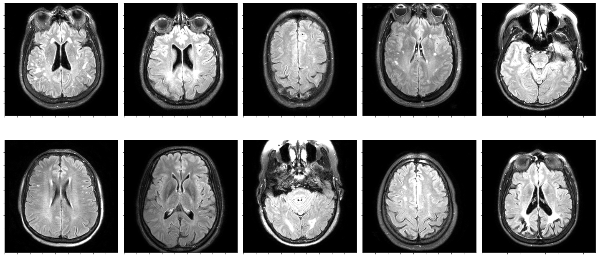
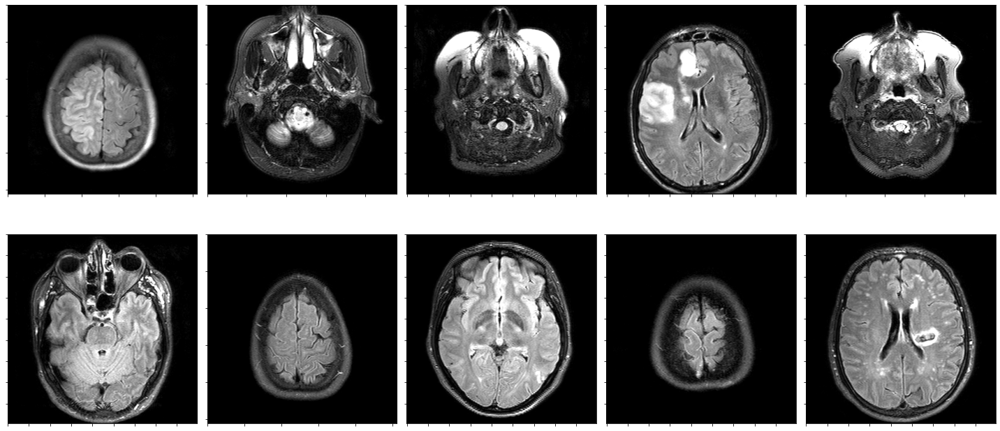
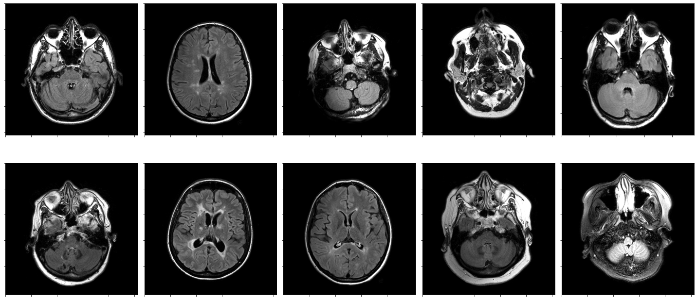
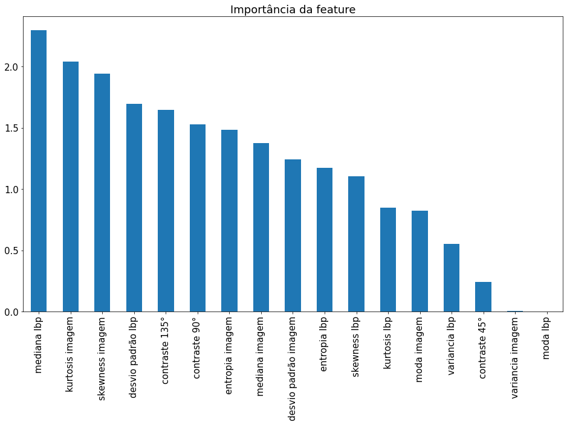
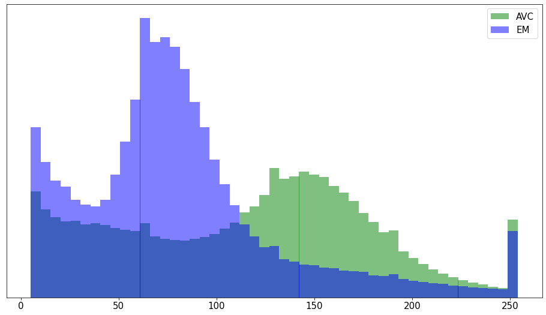

# Projeto 4 – Classificação de lesões de substância branca no Lúpus

O objetivo geral do projeto é, a partir de uma classificador treinado em imagens de ressonância do cérebro para diferenciar lesões isquêmicas e desmielinizantes, identificar qual a etiologia mais provável das lesões presentes em pacientes de Lúpus Eritematoso Sistêmico (LES).

A equipe pode usar qualquer tipo de classificador para a tarefa, desde o SVM já treinado e entregue na Atividade 11, como outro classificador baseado ou não em DL. Os dados de teste não devem ser incorporados no treinamento do classificador.

O conjunto de dados de lesões de pacientes de LES foram compartilhados pelo Google Drive (link nas instruções do P4 no Classroom).

Para o processamento dos dados e treinamento do classificador, sugere-se usar notebooks (e.g., Jupyter).

# Relatório Final de Projeto P4

## Apresentação

O presente projeto foi originado no contexto das atividades da disciplina de pós-graduação [*Ciência e Visualização de Dados em Saúde*](https://ds4h.org), oferecida no primeiro semestre de 2022, na Unicamp.

|Nome  | RA | Especialização|
|--|--|--|
| Guilherme Augusto Amorim Terrell  | 168899  | Elétrica|
| Matheus Xavier Sampaio  | 220092  | Computação|

## Introdução

Neste problema, gostaríamos de identificar, dados alguns pacientes com lúpus, a partir de imagens de ressonância do cérebro,
 identificar a etiologia mais provável das lesões presentes nestes pacientes, lesão "isquêmica" (AVC) ou "desmielinizante" (EM).

Assim, a pergunta que gostaríamos de responder é a seguinte:
    Qual a etiologia das lesões de pacientes de lúpus?

### Ferramentas

- `scikit-learn`
- `matplotlib`
- `numpy`
- `scipy`
- `scikit-image`

### Preparo e uso dos dados

> TODO: Descrever brevemente o cada atributo escolhido.

- normalização: A partir das análises aplicando diferentes normalizações nas imagens de ressonância apresentadas, decidimos não aplicar nenhum tipo de normalização, pois nenhum deles apresentou melhoras na identificação da lesão na imagem em relação a imagem original.
- uso das máscaras: Analisando as máscaras, decidimos não aplicar a segmentação das imagens, pois os experimentos realizados não apresentaram uma melhora significativa nos resultados aplicando as mascaras.
- extração de atributos: Escolhemos 3 atributos a partir de nossos experimentos, sendo estes
  - Estatísticas do histograma da imagem
  - Estatísticas do histograma de textura usando o Local Binary Pattern
  - Contraste da imagem

## Metodologia

> TODO: Descrever brevemente o SVM e o kernel Linear.

Como classificador, escolhemos o algoritmo `Support Vector Machine`, com kernel `Linear`.

Os dados de treinamento foram separados de acordo com cada paciente, permitindo assim o uso de validação cruzada na avaliação durante o treinamento. Foi escolhido um $k = 5$.

Para as métricas, foram utilizadas as métricas de classificação `Acurácia`, `Precisão`, `Revocação` e `F1-score`.
Estas métricas permitem avaliar numericamente a porcentagem de acertos do classificador, assim como sua efetividade em reduzir falsos positivos e falsos negativos.

A tabela abaixo apresenta os resultados das métricas nos conjuntos de validação em cada etapa do treinamento.

```txt
Acurácia do SVM após 5 folds: 92.28 % (±15.01)
Precisão do SVM após 5 folds: 83.68 % (±32.24)
Revocação do SVM após 5 folds: 99.85 % (±0.30)
F1 do SVM após 5 folds: 86.28 % (±27.04)
```

Ao avaliar o classificador num conjunto de teste não visto anteriormente, sua acurácia foi de $98\%$.

## Resultados Obtidos e Discussão

Com o uso do classificador, foi identificado que $99.94\%$ das imagens de ressonãncia dos pacientes com lúpus se assemelham mais com lesões de `AVC`. Isso significa que, das 697 imagens, 694 foram classificadas como `AVC` e apenas 3 como `EM`.

|  |
|:--:|
| **Exemplos de ressonância de pacientes com lúpus** |

Vamos observar agora algumas imagens de pacientes com lesão isquêmica e lesão desmielinizante, a fim de examinar se conseguimos perceber semelhanças visuais claras com as lesões de lúpus.

|  |
|:--:|
| **Exemplos de ressonância de pacientes com  lesão isquêmica (AVC)** |

|  |
|:--:|
| **Exemplos de ressonância de pacientes com  lesão desmielinizante (EM)** |

Mesmo a olho nú, podemos perceber que as lesões de lúpus apresentam intensidade e tamanhos mais semelhantes as lesões de AVC.

|  |
|:--:|
| **Influencia dos atributos na decisão do classificador** |

A imagem a cima nos descreve a influência positiva e negativa de cada atributo extraído da imagem na decisão do classificador.
O atributo mais influente identificado foi o de mediana da textura extraída pelo lbp. Isso significa que a textura da área de lesão possui uma diferença bem alta comparando lesão isquêmica e desmielinizante. Os atributos seguintes foram skewness e kurtosis da imagem, que analisam inclinação e caudas dos histogramas. Isto reforça nossa análise visual, pois esperamos que as imagens com AVC possuam pixels com valores mais intensos que com EM, o que causa diferentes formatos nos histogramas. A imagens dos histogramas abaixo confirma nossa teoria.

|  |
|:--:|
| **Histogramas aglomerados de imagens de lesões isquêmicas e desmielinizante** |

Os outros atributos com maior influência são de contraste e entropia, novamente reforçando a analise visual das imagens de ressonância.

## Conclusão

Respondendo a pergunta apresentada no início do relatório, podemos concluir após um estudo e construção do classificador, e a análise dos seus resultados, que as lesões presentes em pacientes de Lúpus Eritematoso Sistêmico (SLE) possuem etiologia similar a lesões isquêmicas.

Durante o processo, as escolha dos melhores atributos para extrair das imagens foi um desafio devido ao grande número de características e transformações possíveis, assim a realização de experimentos e analises qualitativas foi fundamental na escolha.

Outra dificuldade encontrada foi após a escolha destes atributos, como realizar sua extração em massa e separação dos dados para realização do treinamento do algoritmo de classificação.

Por fim, como trabalhos futuros e evoluções, algo a ser considerado é que um algoritmo e atributos simples foram capazes de atingir métricas muito altas, o que é uma indicação que de pode existir algum tipo de viés no conjunto de dados, assim, uma análise exploratória destes dados, assim como a obtenção de um conjunto de dados mais extenso é essencial para uma continuidade do trabalho. Com isto em mente, podem ser explorados diferentes algoritmos e técnicas de classificação, como o uso de Aprendizado Profundo e Redes Convolucionais.
